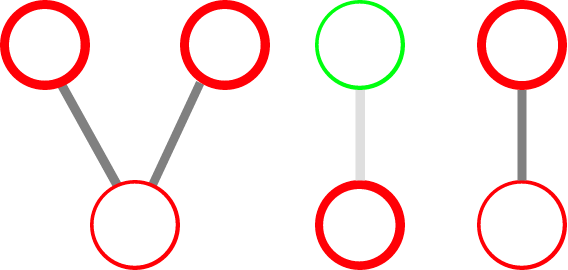
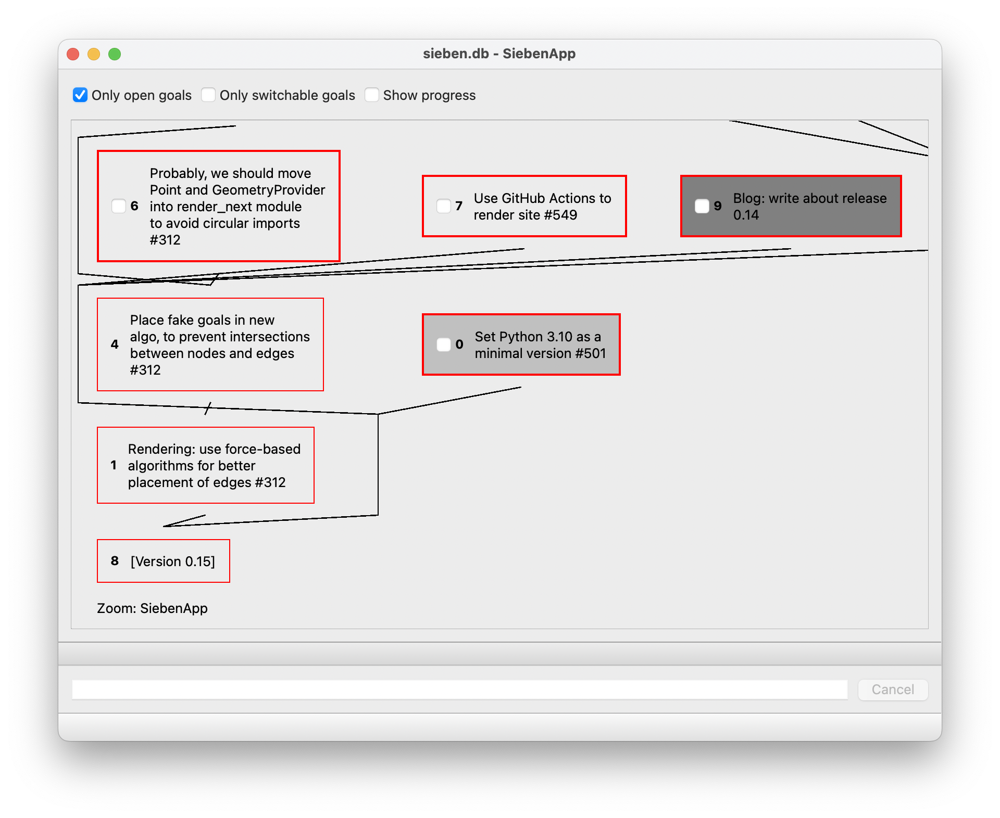

# SiebenApp: experimental dependency-aware goal manager



## Motivation

Why you may need yet another task manager app in 2016? There are thousands of apps and sites nowadays that allow to create tons of checklist, or stacks of cards, or something like that... But there are two serious problems with checklists and cards.

First, it's usually hard to manage task/goals of differrent sizes. It's usually impossible to solve one big goal completely at once. So, it's natural to split it into several smaller subgoals. But what if some of subgoals are still too big? You have to split them again. But! Most of task/goal managers (at least ones seen by this project's author) do not allow you to easily create more than 1 layer of subtasks/subgoals.

Second, not all goals are independent from each other. Here, the word "independence" means that you may complete goals in any order. Usually, that's not true. Some goals are often prefferable to be completed before other ones. But, again, most of task/goal managers don't allow you to define or visualise such dependencies. Usually, all you can get is just trivial ordering. And you have to review and reorder your goals manually every time.

SiebenApp is an experimental goal manager that tries to solve these problems.



## Installation

In order to run SiebenApp you need to have Python 3.10+.

### Installation into virtual environment

To use SiebenApp within venv, you should have [poetry](https://python-poetry.org/docs/) installed.

1. Clone this repository.
2. Initialize virtual environment and install dependencies:

```shell
poetry install
```

3. Run application:

```shell
poetry run sieben
```

OR

```shell
make run
```

### System-wide installation

#### Installation via pipx

You could install SiebenApp as a terminal application simply by calling:

```shell
pipx install git+https://github.com/ahitrin/SiebenApp
```

#### Installation from source

The only Python dependency required is `PySide6` (needed to draw user interface).
If it's installed locally, you could run `sieben` right away.

1. Clone this repository.
2. Install `PySide6` (for example, via `pip`):

```shell
pip install PySide6
```

3. Run application:

```shell
make run
```

If your OS supports FreeDesktop specifications (like Linux or FreeBSD), you may want to add a Desktop file to your DE.
To do this:

1. Copy `SiebenApp.desktop` file to your `~/.local/share/applications` directory.
2. Replace `_SIEBEN_APP_DIR_` placeholder with full path to SiebenApp cloned directory.
3. If needed, replace default path to Python3.10 with your own path.
You could find it by calling `which python3`.

### CLI tools

For CLI tools, like `clieben` and `sieben-manage`, no additional dependencies are needed.
They use plain Python only.

### Without cloning

Currently, there is no separate package distribution and/or installer for SiebenApp.
If you need one, please let me know in [#1](https://github.com/ahitrin/SiebenApp/issues/1).

## How it works

The word "sieben" means "seven" in German. This name reflects broadly known idea that human mind is usually possible to keep control on 7±2 thoughts at most. Therefore, a good goal manager should reduce amount of visible goals when they are not being processed.

Crucial ideas how to remove amount of active goals are simple:

 * All goals are stored in a _directed graph_, not just simple list.
 * Goal may _block_ each other. Subgoals block their parents. Additional links may be created and removed manually.
 * Only _top goals_ (both open and not blocked) should be worked on. Other goals could easily be hidden, so they don't distract you.

If you'd like to view a **tutorial**, please proceed [here](tutorial.md).

## Usage tips

You might not want to keep all of your tasks in a single file (`sieben.db` by default). So you could provide path to another database file in the command line:

    sieben another.db

In case this file doesn't exist, SiebenApp will create it!

This simple feature may help a lot when you want to use SiebenApp for different goals. Just create a new DB file for each separate goal you want to achieve. Store all DB files in any folder you want.

For more examples, please visit `doc/examples` folder.

## Alpha version warning

Please take into consideration that here you see the very early Alpha release of the app. It means that a lot of compromises have taken place during its development. Among them there are following ones:

1. **No packaging/installation yet** ([#1](https://github.com/ahitrin/SiebenApp/issues/1)). In order to run app, clone or download the code, and then use `make` to check/install dependencies and `make run` or `poetry run sieben` to run.
2. **Really simple UI**. There is a lack of buttons, icons and something like that. Most of the actions are available by hotkeys only (see [tutorial](tutorial.md) for examples).

All these points are planned to be fixed while moving from Alpha to Beta version.

Nevertheless, current functionality of the application is already enough for running small to medium projects.

## How to contact/contribute

All kinds of feedback and contribution are kindly welcome!

In case you have a GitHub account, please use traditional ways of feedback: issues and pull requests.

In case you don't have an account, you may e-mail author directly: andrey dot hitrin plus sebenapp at gmail dot com.
