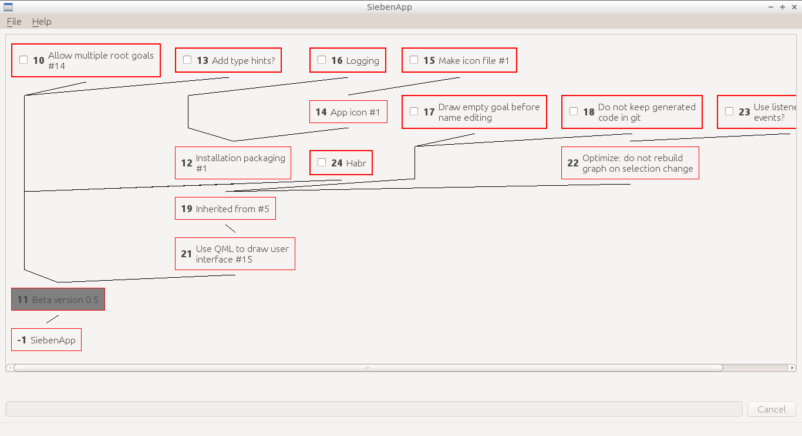

# SiebenApp: experimental dependency-aware goal manager

## Motivation

Why you may need yet another task manager app in 2016? There are thousands of apps and sites nowadays that allow to create tons of checklist, or stacks of cards, or something like that... But there are two serious problems with checklists and cards.

First, it's usually hard to manage task/goals of differrent sizes. It's usually impossible to solve one big goal completely at once. So, it's natural to split it into several smaller subgoals. But what if some of subgoals are still too big? You have to split them again. But! Most of task/goal managers (at least ones seen by this project's author) do not allow you to easily create more than 1 layer of subtasks/subgoals.

Second, not all goals are independent from each other. Here, the word "independence" means that you may complete goals in any order. Usually, that's not true. Some goals are often prefferable to be completed before other ones. But, again, most of task/goal managers don't allow you to define or visualise such dependencies. Usually, all you can get is just trivial ordering. And you have to review and reorder your goals manually every time.

SiebenApp is an experimental goal manager that tries to solve these problems.

## How it works

The word "sieben" means "seven" in German. This name reflects broadly known idea that human mind is usually possible to keep control on 7±2 thoughts at most. Therefore, a good goal manager should reduce amount of visible goals when they are not being processed.

Crucial ideas how to remove amount of active goals are simple:

 * All goals are stored in a _directed graph_, not just simple list.
 * Goal may _block_ each other. Subgoals block their parents. Additional links may be created and removed manually.
 * Only _top goals_ (both open and not blocked) should be worked on. Other goals could easily be hidden so they don't distract you.

Let's take a look at simple example.

... (example)

## Alpha version warning

Please take into consideration that here you see the very early Alpha release of the app. It means that a lot of compromises have taken place during its development. Among them there are following ones:

1. **No packaging/installation yet**. In order to run app, clone or download the code, and then use `make` to check/install dependencies and `make run` to run.
2. **Really stupid UI**. Currently, all goals are drawn using [GraphViz](http://www.graphviz.org/), and SiebenApp just shows resulting image. Also, there are no buttons, icons and something like that. The only thing we have is a set of hotkeys.
3. **Primitive persistence, absence of migrations**. Current state of goal tree is kept in file `sieben.db`. Despite of its extension, it's nothing more than raw dump of app's inner state made with `pickle` module. Therefore it's impossible to keep several goal trees (like several projects and so on) in one file. But you may manage these files by hand or call SiebenApp from another file path. For example, like that:

        # store several files in the current directory
        mv sieben.db sieben.db.project1
        mv siben.db.project2 sieben.db
        make run
        # or, another way: call SiebenApp from another path
        cd ../project1
        ../SiebenApp/.env/bin/python ../SiebenApp/sieben.py

4. **No actual security**. To draw goals graph, SiebenApp calls external program `dot` which is supposed to be a part of GraphViz package. It's theoretically possible that the called `dot` program may do any unexpected action instead, even something malicious.

All these points are planned to be fixed while moving from Alpha to Beta version.

Nevertheless, current functionality of the application is already enough for running small projects. Even its own development planning is already have being done in itself. See:

## How to contact/contribute

All kinds of feedback and contribution are kindly welcome!

In case you have a GitHub account, please use traditional ways of feedback: issues and pull requests.

In case you don't have an account, you may e-mail author directly: siebenapp plus andrey dot hitrin at gmail dot com.
