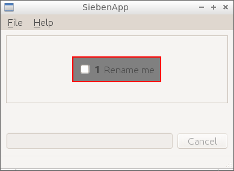
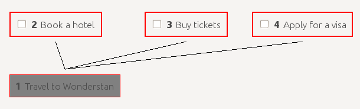
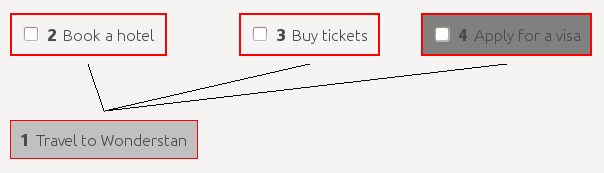
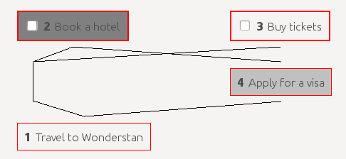
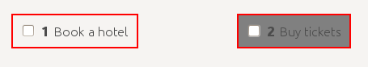
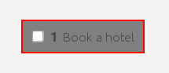
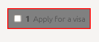
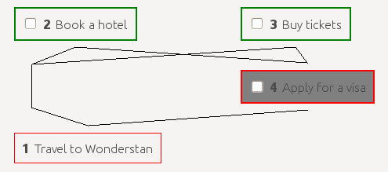

# SiebenApp: experimental dependency-aware goal manager

## Motivation

Why you may need yet another task manager app in 2016? There are thousands of apps and sites nowadays that allow to create tons of checklist, or stacks of cards, or something like that... But there are two serious problems with checklists and cards.

First, it's usually hard to manage task/goals of differrent sizes. It's usually impossible to solve one big goal completely at once. So, it's natural to split it into several smaller subgoals. But what if some of subgoals are still too big? You have to split them again. But! Most of task/goal managers (at least ones seen by this project's author) do not allow you to easily create more than 1 layer of subtasks/subgoals.

Second, not all goals are independent from each other. Here, the word "independence" means that you may complete goals in any order. Usually, that's not true. Some goals are often prefferable to be completed before other ones. But, again, most of task/goal managers don't allow you to define or visualise such dependencies. Usually, all you can get is just trivial ordering. And you have to review and reorder your goals manually every time.

SiebenApp is an experimental goal manager that tries to solve these problems.

## How it works

The word "sieben" means "seven" in German. This name reflects broadly known idea that human mind is usually possible to keep control on 7±2 thoughts at most. Therefore, a good goal manager should reduce amount of visible goals when they are not being processed.

Crucial ideas how to remove amount of active goals are simple:

 * All goals are stored in a _directed graph_, not just simple list.
 * Goal may _block_ each other. Subgoals block their parents. Additional links may be created and removed manually.
 * Only _top goals_ (both open and not blocked) should be worked on. Other goals could easily be hidden so they don't distract you.

Let's take a look at simple example: travel planning.

Imagine that you want to travel into the beautiful country Wonderstan. Inspired by this idea, you run SiebenApp and start to plan your travel.

    ./sieben

SiebenApp starts with a single default goal.

Let's _rename_ this goal! Press `r`, type new goal name into the text field and press `Enter`.

So it changes:

There are two obvious subgoals: book a hotel and buy airplane tickets. Also, Wonderstan has strict visiting rules: it requires visa for all visitors. To _add_ a subgoal, press `a`, enter its name, and then press `Enter` to finish. Repeat it for all goals.

But wait! Before applying for a visa you need to collect all documents needed, including both booking and tickets. It means that first two subgoals are blocking the third one. Subgoal 4 may be started only after completion of subgoals 2 and 3. Let's reflect this dependency in our plan. Press `4` to select a subgoal...

...then press `Space` so this selection will be remembered, and next press `2` and `l`.

Voila! The _link_ has been created. Let's repeat this with another subgoal. Now you may just press `3` and `l` since your _previous selection_ still remains at the subgoal 4.

Now we have one big goal with 3 smaller subgoals. And only 2 of these subgoals actually respects your attention right now. They are marked with **bold border**. In addition, you may completely hide blocked goals so they don't distract your focus. Just press `v` to change _view_.

As you may see, enumeration of goals has been changed. This is done in order to simplify work with a large amount of goals. Even when your goaltree has tens of subgoals, there are only few of them on the top usually. With using enumeration only for the visible goals we make goal selection easier.

Now you don't need to think about visa. Being focused well on a single goal, you find good tickets and buy them. Now it's time to _close_ current subgoal. Just press `c` for that.

Wow, it disappears! And you may become even more focused because now you see the only one goal. Don't forget to _select_ it with `2` and _close_ with `c` when it will be ready.

Something interesting happens. Your current goal has been replaced with the new one. It means that nothing stops you from applying for a visa right now. Neat! Press `v` to change _view_ again and look what happens behind the scenes.

Here we see that two closed goals still exists in a graph, but now they are marked green. And subgoal 4 is marked with bold border because no other open goal blocks it. Goal enumeration also changes back to the order you've created goals in.

Now just play around freely using following buttons:

 * `1`..`0` (according to the keyboard layout) for _selecting_ goals (when you have more than 10 goals, each selection needs 2 key presses);
 * `a` for _adding_ new subgoals;
 * `d` for _removing_ them (please note that removing is **undoable**, and may remove all subgoals of the current one);
 * `c` for _closing_ current goal, and also for re-open closed one;
 * `r` for _renaming_;
 * `Space` for _holding_ (remembering) current selection;
 * `l` for creating new _link_ between remembered and current selections (current selection becomes subgoal of the remembered one), and also for removing existing links;
 * `i` for _inserting_ new goal between remembered and current selections;
* `Esc` to cancel changes you're currently doing when _add_, _insert_, or _rename_ a goal.
 * `z` for _zooming_ to the given goal or _unzooming_ back to all goals;
 * `v` for circular switching current _view_: only open goals → only "top" goals → all goals → ...;
 * `q` for quitting when you are impressed enough.

## Usage tips

You might not want to keep all of your tasks in a single file (`sieben.db` by default). So you could provide path to another database file in the command line:

    ./sieben another.db

In case this file doesn't exist, SiebenApp will create it!

This simple feature may help a lot when you want to use SiebenApp for different goals. Just create a new DB file for each separate goal you want to achieve. Store all DB files in any folder you want.

For more examples, please visit `docs/examples` folder.

## Alpha version warning

Please take into consideration that here you see the very early Alpha release of the app. It means that a lot of compromises have taken place during its development. Among them there are following ones:

1. **No packaging/installation yet** (#1). In order to run app, clone or download the code, and then use `make` to check/install dependencies and `make run` or `./sieben` to run.
2. **Really stupid UI** (#4). Currently, all goals are drawn using [GraphViz](http://www.graphviz.org/), and SiebenApp just shows resulting image. Also, there are no buttons, icons and something like that. The only thing we have is a set of hotkeys.
3. **No actual security** (#5). To draw goals graph, SiebenApp calls external program `dot` which is supposed to be a part of GraphViz package. It's theoretically possible that the called `dot` program may do any unexpected action instead, even something malicious.

All these points are planned to be fixed while moving from Alpha to Beta version.

Nevertheless, current functionality of the application is already enough for running small projects. Even its own development planning is already have being done in itself. See:

## How to contact/contribute

All kinds of feedback and contribution are kindly welcome!

In case you have a GitHub account, please use traditional ways of feedback: issues and pull requests.

In case you don't have an account, you may e-mail author directly: andrey dot hitrin plus sebenapp at gmail dot com.
