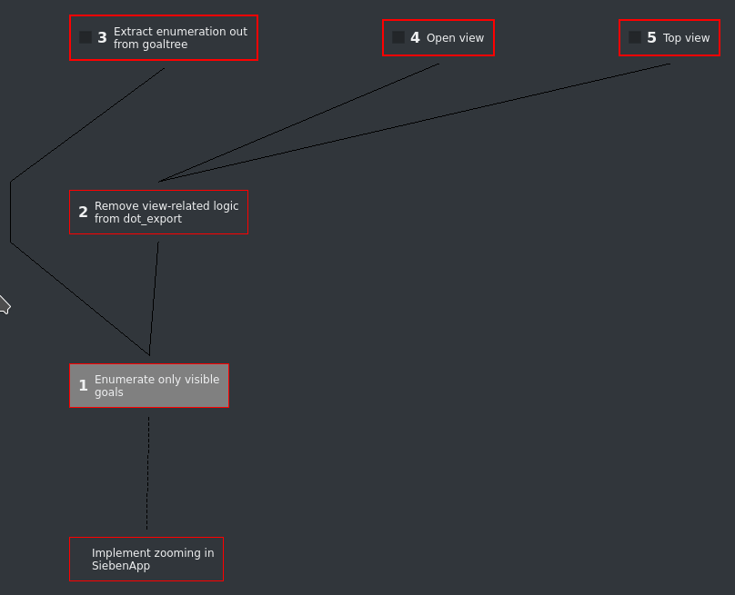
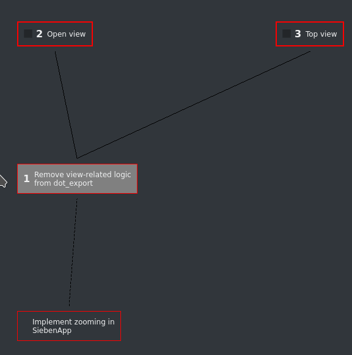

# Zoom / Unzoom

Suppose you work on a large goal that could be separated into several steps (like most of the goals do).

In order to **focus** on certain sub-goal you'd better make others invisible for a while. They should be visible only when needed.

That's quite easy with Zoom feature (available since version 0.3). First, you need to select a sub-goal you'd like to be zoomed to. A goal `10` in our example would be a good choice. So we select it using a mouse or by pressing `1` and `0`.

Now, press `z` to start zooming. What happened?

You may notice following things:

1. All sub-goals that don't block the selected one have become invisible. Visible goal tree becomes much simpler than the original one!
2. Goals enumeration is also changed. While original tree have more than 20 items, after zoom you only have 5 of them. So it's possible to use the simplest goal enumeration. Now you need to press only one number button to switch between sub-goals.
3. Your main goal is still displayed below, but it has no number and cannot be selected anyway. This is visual _hint_ that reminds you that your goal tree is zoomed.

You may try to select another sub-goal (say, number `2`) and press `z` again. This causes further zooming.

Your current zoom status is stored between application restarts, so you don't have to be bothered about other sub-goals each time you have to restart the application. But when you need to see them again just select your lowest sub-goal in a tree ("zoom root") and press `z` again as many times as you've pressed it before.

Ta-dam! There are all of them again! Now you may grow and groom you goal tree or choose another sub-goal to work on.

Use zooming together with other features (links, views, and so on) to solve complex goals without damage to you focus!
