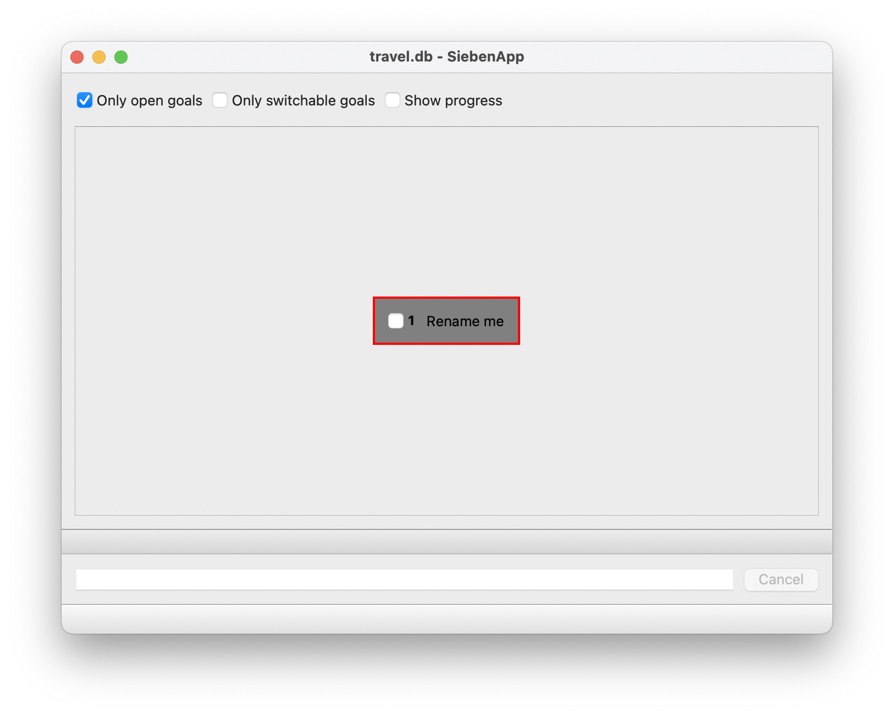
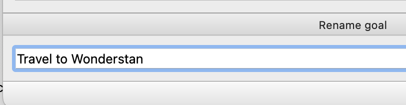
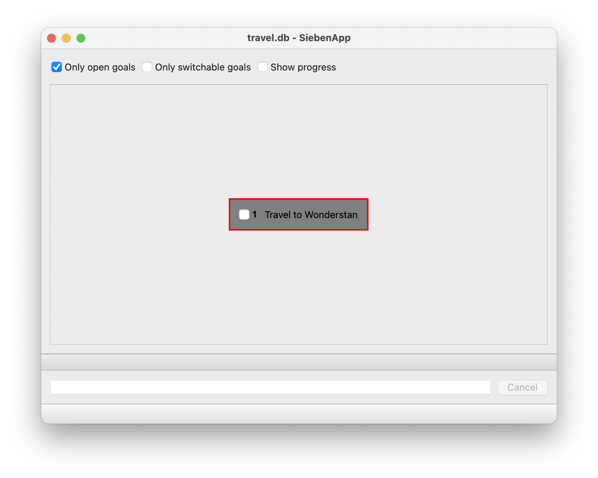
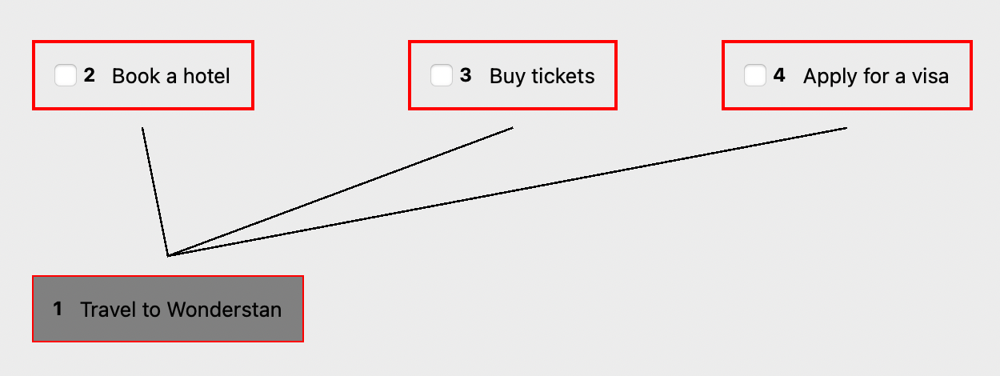
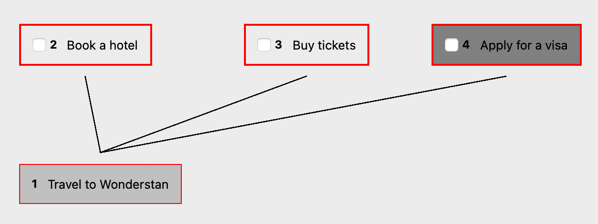
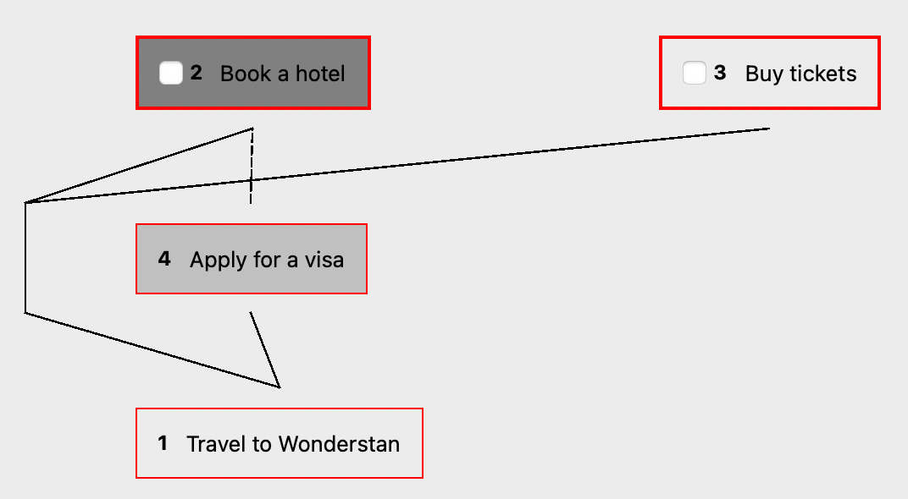
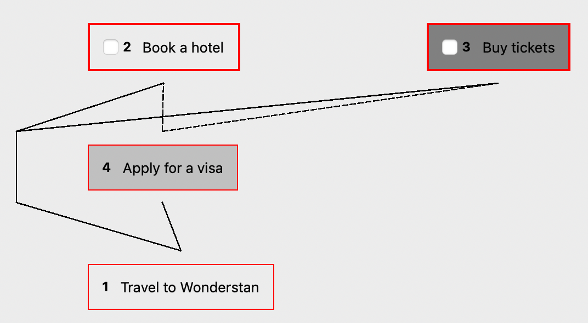
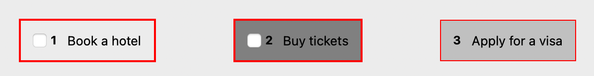
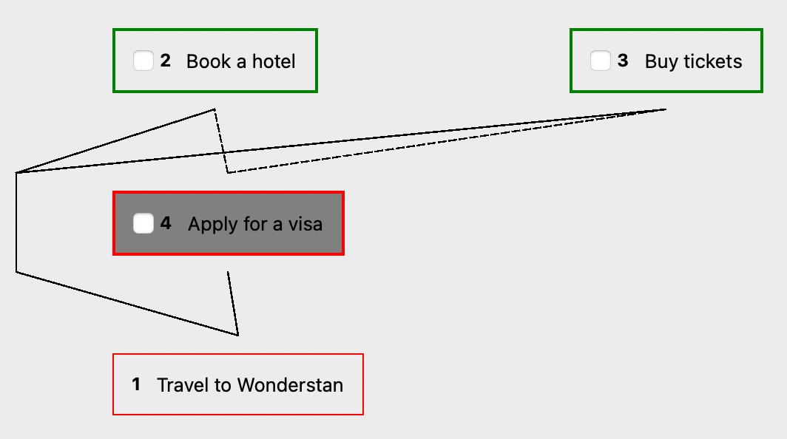

# Tutorial

Let's take a look at simple example: travel planning.

Imagine that you want to travel into the beautiful country Wonderstan. Inspired by this idea, you run SiebenApp and start to plan your travel.

    ./sieben travel.db

SiebenApp starts with a single default goal.

Let's _rename_ this goal! Press `r`, type new goal name into the text field and press `Enter`.

So it changes:

There are two obvious subgoals: book a hotel and buy airplane tickets. Also, Wonderstan has strict visiting rules: it requires visa for all visitors. To _add_ a subgoal, press `a`, enter its name, and then press `Enter` to finish. Repeat it for all goals.

But wait! Before applying for a visa you need to collect all documents needed, including both booking and tickets. It means that first two subgoals are blocking the third one. Subgoal 4 may be started only after completion of subgoals 2 and 3. Let's reflect this dependency in our plan. Press `4` to select a subgoal, on just click on it.

Then press `Space` so this selection will be remembered. Select subgoal `2` and then press `l`.

Voila! The _link_ has been created. Let's repeat this with another subgoal. Now you may just press `3` and `l` since your _previous selection_ still remains at the subgoal 4.

Now we have one big goal with 3 smaller subgoals. And only 2 of these subgoals actually respects your attention right now. They are marked with **bold border**. In addition, you may completely hide blocked goals, so they don't distract your focus. Just press `t` to change view.

As you may see, enumeration of goals has been changed. This is done in order to simplify work with a large amount of goals. Even when your goaltree has tens of subgoals, there are only few of them on the top usually. With using enumeration only for the visible goals we make goal selection easier.

The "Apply for a visa" goal is still here, but it becomes "non-switchable". It has no checkbox on. Don't worry! It should appear again when the time comes. Now you'd better even hide it by typing `Space` again (focusing on the "Buy tickets" goal).

Now you don't need to think about visa. Being focused well on a single goal, you find good tickets and buy them. Now it's time to _close_ current subgoal. Just click on the goal's checkbox or press `c` key.

Wow, it disappears! And you may become even more focused because now you see the only one goal. Close it in the same way as the previous one.

Something interesting happens. Your current goal has been replaced with a new one. It means that nothing stops you from applying for a visa right now. Neat! Press `t` and `n` one after one to change _view_ again and look what happens behind the scenes.

Here we see that two closed goals still exists in a graph, but now they are marked green. And subgoal 4 is marked with bold border because no other open goal blocks it. Goal enumeration also changes back to the order you've created goals in.

Now just play around freely using following buttons:

 * `1`..`0` (according to the keyboard layout) for _selecting_ goals (when you have more than 10 goals, each selection needs 2 key presses; and only for tens/hunderds of goals you need to make 3+ key presses);
 * `a` for _adding_ new subgoals (with _child link_ between current goal and subgoal);
 * `c` for _closing_ current goal, and also for re-open closed one;
 * `r` for _renaming_;
 * `Space` for _holding_ (remembering) current selection;
 * `Esc` to cancel changes you're currently doing when _add_, _insert_, or _rename_ a goal, or use a _filter_;
 * `l` for creating new _blocking link_ between remembered and current selections (current selection becomes "blocker" for the remembered one), and also for removing existing blocking links;
 * `k` for creating/removing a _child link_ between remembered and current selections - please note that each goal could have at most 1 parent, and an old _child link_ will be replaced with _blocking link_;
 * `i` for _inserting_ new goal between remembered and current selections;
 * `z` for _zooming_ to the given goal or _unzooming_ back to all goals (see [zoom usage example](/doc/examples/zoom.md));
 * `n` for switching current _view_ between only open goals (default) and open+closed;
 * `t` for switching current _view_ between tree view (default) and only-switchable (like todo-list);
 * `p` for showing progress for each subgoal (it's simply a ratio between a number of closed subgoals and total subgoals including current goal itself);
 * `f` for _filtering_ all visible goals by a given substring (filtering is case-insensitive);
 * `d` for _removing_ subgoals (please note that removing is **undoable**, and may remove all subgoals of the current one);
 * `o` for _opening_ another goaltree file;
 * `+` for increasing a number of columns shown (useful when the app is opened in a full-screen mode on a wide monitor);
 * `-` for decreasing a number of columns (useful on a small monitor or in a part-screen mode)
 * `q` for quitting when you are impressed enough.

To view this list in the application itself, please use `/` button (or menu item).
